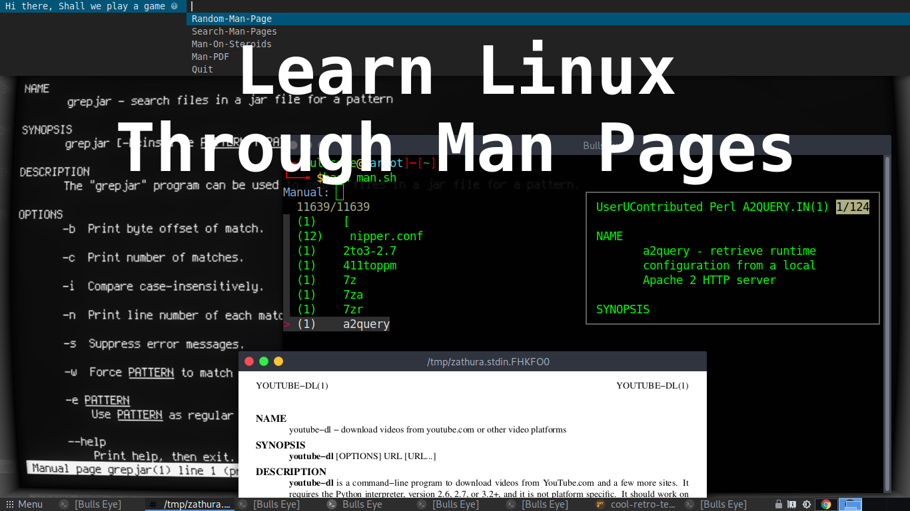

# Man Eye
How cool would it be to learn Linux through the man pages To make it even more fun, I made this script with various options and with a cool retro terminal.

I recommend to watch the video so you can see the install the various options, how you can adjust this script to your own needs, and someother cool things.

Here you can read the article on BullsEye0.com

Somehow the man pages always remind me a bit of the past, to old school. I've also been told by "Linux people" that they **learned Linux just by reading the manual pages**. How cool is that.!

This is nonsense, of course, **or am I wrong** here that the man pages have to do with the past. I went to find out and looked it up.

In the first two years of the history of Unix, no documentation existed. The first Unix Programmer's Manual was first published on November 3, 1971.

So actually the man pages have been around for so long, even before people started using the Internet, the world wide web (www) and even before Microsoft existed.

***

***

## Man Eye

To be able to use Man Eye, some other "awesome" tools have to be installed. This depends a bit on which Linux distribution you use.
This script has been tested on Debian-based and Arch Linux.

`sudo apt install suckless-tools`

`sudo apt install cool-retro-term`

`sudo apt install zathura`

`sudo apt install groff`

`sudo apt install fzf`

## Or in one line: 

`sudo apt install suckless-tools zathura groff cool-retro-term fzf`

*****

## Install Man Eye

git clone 

cd man-eye

***

## Use Man Eye

bash man-eye.sh

***

## There are 5 options you can use 

- **Random-Man-Page** 
    As the name predicts, this option chooses a random manual page. Maybe a great idea to select and learn a random Man Eye page every day :smily:
 
- **Search-Man-Pages**
    This option allows you to search for a manual page via the dmenu
    
- **Man-On-Steroids**
    How cool is this option! In the square in your terminal you can already read a bit about what it is about.
    
- **Man-PDF**
    The output of the man page in a PDF format. Here I chose Zathura. Zathura is a minimalist and is a highly customizable document viewer. It is easy to print in PDF format.
    
- And of course as the last the **"Quit"**

To exit all windows, just press the "q" to quit.

***
